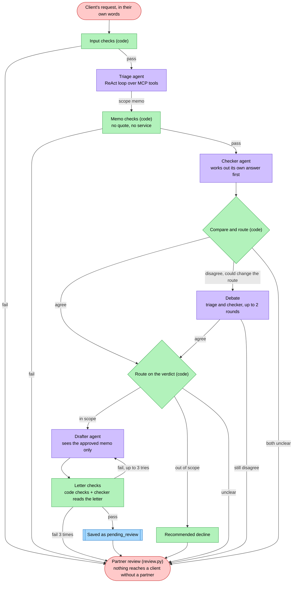

# Engagement Letter Agentic Pipeline

A multi-agent system that takes a prospective client's request, written in their own words, and turns it into a **draft engagement letter** for a partner to review. It is built for SB&P, a Kuwaiti audit and advisory firm with 45 services across nine service lines.

The hard part is **restraint**. Some requests fall outside the firm's services, and a model answering from memory maps them onto whichever service sounds closest. The pipeline must be able to effectively differentiate, and send unclear or ambiguous cases to a partner/human for a decision. Nothing is sent to a client: every letter stops at partner review.

> Course project for Agentic AI (DSC 627O), Lebanese American University. **All client and prospect data is invented.**

**Status:** work in progress.

## How it works



Purple: agents (LLMs) · green: plain code · blue: database · pink: people. Every route ends with a partner. Triage, the checker and the drafter reach the database only through the `sbp-data` MCP server, each with only the tools its role needs.

| Agent | Model | Job |
| --- | --- | --- |
| Triage | gemma4:12b | Finds the client, splits the request into needs, searches the catalog once per need, writes the scope memo |
| Checker | qwen3.5:9b | Works out its own answer from the same request (never seeing triage's), then code compares the two; later reads the draft letter |
| Drafter | gemma4:12b | Writes the client-specific parts of the letter from the approved memo only |


## Requirements

- Python 3.11+
- [Ollama](https://ollama.com/download), running locally
- About 16 GB of free disk space for the three models

No API keys are needed. Everything runs locally.

Commands below use `python3` (macOS / Linux). On Windows, type `python` instead.

## Setup

```bash
# 1. Pull the models: one writes, one checks, one powers the catalog search
ollama pull gemma4:12b
ollama pull qwen3.5:9b
ollama pull embeddinggemma

# 2. Create a virtual environment and install the packages
python3 -m venv .venv
source .venv/bin/activate        # Windows: .venv\Scripts\activate
pip install -r requirements.txt

# 3. Build the database (45 services, invented clients and prospects)
python3 data/build_db.py

# 4. Check that everything is in place
python3 check_setup.py
```

## Run

```bash
python3 run.py intakes/record_1_al_rawdah.txt
```

Each run prints triage's scope memo, the checker's own view, where the two differ, and the route the case took (and the draft letter, if one was written). Every step is also saved to `runs/<run_id>.jsonl`.

Where a case can end:

| Route | When | What is saved |
| --- | --- | --- |
| draft | triage and checker agree it is in scope, and the letter passes its checks | a draft letter, status `pending_review` |
| decline | triage and checker agree it is out of scope | a *recommended decline* in the partner's queue |
| partner | anything else: failed input or memo checks, triage and checker disagree, an unclear verdict, or a letter that fails its checks 3 times | an escalation, with every reason |

When triage and the checker disagree in a way that could change the route, they **debate**: each sees the other's answer and may change its mind, for up to 2 rounds, stopping as soon as they agree. If they still disagree, a partner decides.

Nothing is ever sent to a client. A partner reviews every case:

```bash
python3 review.py                 # what is waiting
python3 review.py draft 1         # evidence + letter, then approve / reject / revise
python3 review.py escalation 1    # reasons + evidence, then resolve with a note
```

`review.py` is the only thing that can change a status. It is not an MCP tool, so no agent can call it.

## Tests

```bash
python3 tests/test_input_checks.py      # no model
python3 tests/test_memo_checks.py       # no model
python3 tests/test_compare.py           # no model
python3 tests/test_letter_checks.py     # no model (uses the MCP server)
python3 tests/test_sbp_data_server.py   # every MCP tool, through MCP
```

**Smaller machine?** Run every role on one model by setting `SINGLE_MODEL`, e.g. `SINGLE_MODEL=gemma4:12b python3 check_setup.py`. Models per role are set in [`config.py`](config.py).

## Project structure

```
run.py            runs the whole pipeline on one intake (python3 run.py --graph shows the graph)
review.py         the partner's review: the only place a status changes
config.py         which model runs each role, and whether it thinks first
check_setup.py    checks Ollama, the models, the database, and each role
intakes/          the three test intakes (client's words + header fields)
prompts/          the agents' instructions, as plain text (edit wording here, not in code)
pipeline/
  input_checks.py      plain-code checks on an intake before any agent reads it
  graph.py             the LangGraph graph: steps, and code-only routing between them
  triage.py            triage agent: ReAct loop over the tools, then the scope memo
  checker.py           checker agent: its own answer first, then code compares it with triage's
  agent_loop.py        the ReAct loop (think, call a tool, read the result, repeat)
  debate.py            debate between triage and checker when they disagree (up to 2 rounds)
  drafter.py           drafting agent (sees the approved scope only) + code checks + checker review
  scope_memo.py        the memo's fixed shape (what every later step works from)
  memo_checks.py       code checks on the memo, incl. "no quote, no service"
  sbp_tools.py         one MCP connection per run; which tools each agent may use
  trace.py             the trace log: one file per run in runs/
servers/
  sbp_data_server.py   MCP server: the only way agents reach the database
data/
  schema.sql      the five tables: services, clients, prospects, drafts, escalations
  seed.sql        the service catalog + invented clients and prospects
  build_db.py     rebuilds data/sbp.db from the two .sql files
  set_service.py  a partner switches a service on or off (e.g. at full capacity)
eval/
  calibrate_search.py  how the search model and its minimum score were chosen
tests/
  test_input_checks.py     the three intakes pass; broken ones fail with a reason
  test_memo_checks.py      quote matching, company matching, owner from tool results
  test_compare.py          comparing triage's memo with the checker's view
  test_letter_checks.py    letter checks: approved services only, no money, no other client's name
  test_sbp_data_server.py  every MCP tool, called through MCP
```

## AI assistance

Designed by Ahmad Al-Essa through the Agentic AI course milestones. Code written with Claude Opus 5.5 (1M context) under his direction, and reviewed and tested by him.
